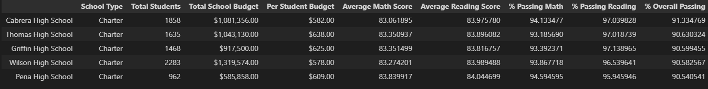
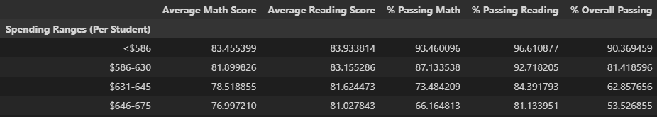

# School District Analysis

## Overview of school district analysis:
#### Mari, a chief data scientist for a city school district, has asked us to find trends and school performance within her school district. After successfully analyzing the data for Maria, it turns out that the reading and math scores for Thomas High School ninth graders were altered. Due to these findings, Maria has now task us to replace these scores with NaNs while keeping the records intact. This will assure that the school district analysis is accurate, fair, and more importantly meets the state-testing standards.

## Resources 
Data Source: schools_complete.csv, students_complete.csv 
Software: Python 3.7, Anaconda 4.14.0, Jupyter Notebook 6.4.12

## School District Analysis Results:

### 1. How is the district summary affected?

- As can be seen in the two images above the overall student count and budget have not been affected.
 However, there was a slight decrease in the average math score and a slight decrease in the percentage of students passing math. As for reading, the average score stayed the same while the percentage of students passing reading slightly decreased. The overall passing percentage decreased by roughly 0.1%/

### 2. How is the school summary affected?

- The following images show the before and after of what was affected in the school summary DataFrame, namely the Thomas High School row. The average math score, average reading score, percentage of passing math, percentage of passing reading, and the percentage of overall score were slightly affected. This is because we do not factor in the 9th grade scores due to them being altered and therefore dropped from our calculations.

### 3.  How does replacing the ninth graders’ math and reading scores affect Thomas High School’s performance relative to the other schools?
- In terms of ranking the schools by overall passing percentage, Thomas High School is still second place. However, only by a slim margin.

### 4. How does replacing the ninth-grade scores affect the following:
- #### <u>Math and reading scores by grade:</u>
    * ##### As can be seen below, math and reading scores for Thomas High School have slightly dropped. This is due to 9th grade scores values being marked as NaN.
    ##### Before:
    
    ##### After:
    

- #### <u>Scores by school spending:</u>
    * ##### Slight decrease in average reading, math scores, percentage passing math, percentage passing reading, and overall passing percentage for schools that are in the $631-645 range. This is due to Thomas High School being in that spending score range.
    ##### Before:
    
    ##### After:
    

- #### <u>Scores by school size:</u>
    * ##### Slight decrease in average reading, math scores, percentage passing math, percentage passing reading, and overall passing percentage for schools that are in the medium school size range (1000-1999).
    ##### Before:
    
    ##### After:
    

- #### <u>Scores by school type:</u>
    * ##### Slight decrease in average reading, math scores, percentage passing math, percentage passing reading, and overall passing percentage for schools that are of the Charter School type.
    ##### Before:
    
    ##### After:
    

## Summary:
The analysis reveals that, taking out Thomas High School's 9th grade math and reading scores, barely affected the dataset. However, there were four changes that should be noted:
- The average math and reading scores for Thomas High School slightly decreased.
- Schools that are in the $631-645 spending range had their overall scores reduced.
- Schools in the medium school size range (1000-1999) saw their overall scores drop slightly.
- And lastly, overall Charter School scores slightly decreased.

The change in data may barely be visible, however, it did slightly decrease the scores of categories in which Thomas High School was present. This is important to note, since any further alteration of scores in the dataset could lead to more drastic overall changes. The School Board should be notified, so that informed choice can be made.
